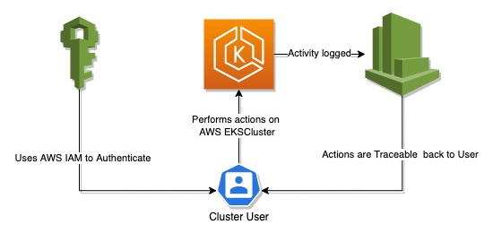

# AWS Auth Operator

This operator helps to manage
['aws-auth'](https://docs.aws.amazon.com/eks/latest/userguide/add-user-role.html) ConfigMap for AWS EKS.

The challenge with *aws-auth* ConfigMap this operator is trying to solve is manual effort to
maintain the ConfigMap. The ConfigMap allows to let specific AWS IAM Roles and Users to use the EKS
cluster, but both approaches are not ideal because: 

* Using MapRoles does not show which user was executing cluster actions in Kubernetes Audit logs
* Using MapUsers resolves the Kubernetes Audit log issue, but there are no good tools to manage the
  users

This operator is supposed to solve these problems by providing a tool for automated IAM Group
synchronization and *aws-auth* ConfigMap management.

{ loading=lazy }

Read my blog article on [IAM User Traceability in AWS
EKS](https://ops42.org/2021/12/19/User-Traceability-In-AWS-EKS.html?utm_source=aws-auth-operator_index&utm_medium=documentation) for more information on the
use-cases.

## Installation

Please check the [installation](installation.md) section
